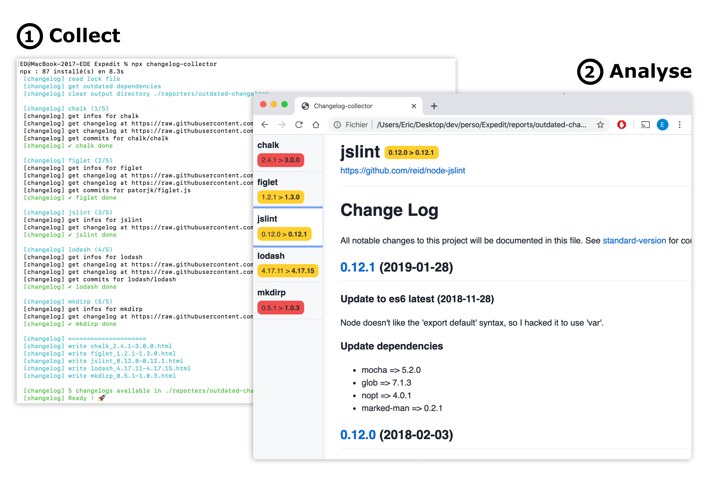

# Changelog collector

CLI tool used to collect all changelogs from your outdated npm dependencies, to help you know what you are doing when upgrading your project.

<p align="center">
  
</p>


## Usage


```bash
npx changelog-collector

```

or

```bash
npx changelog-collector -o my-custom/output/reports-path

```